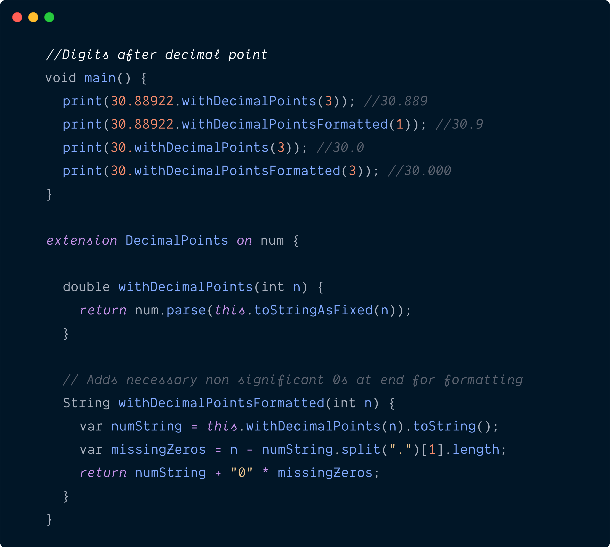
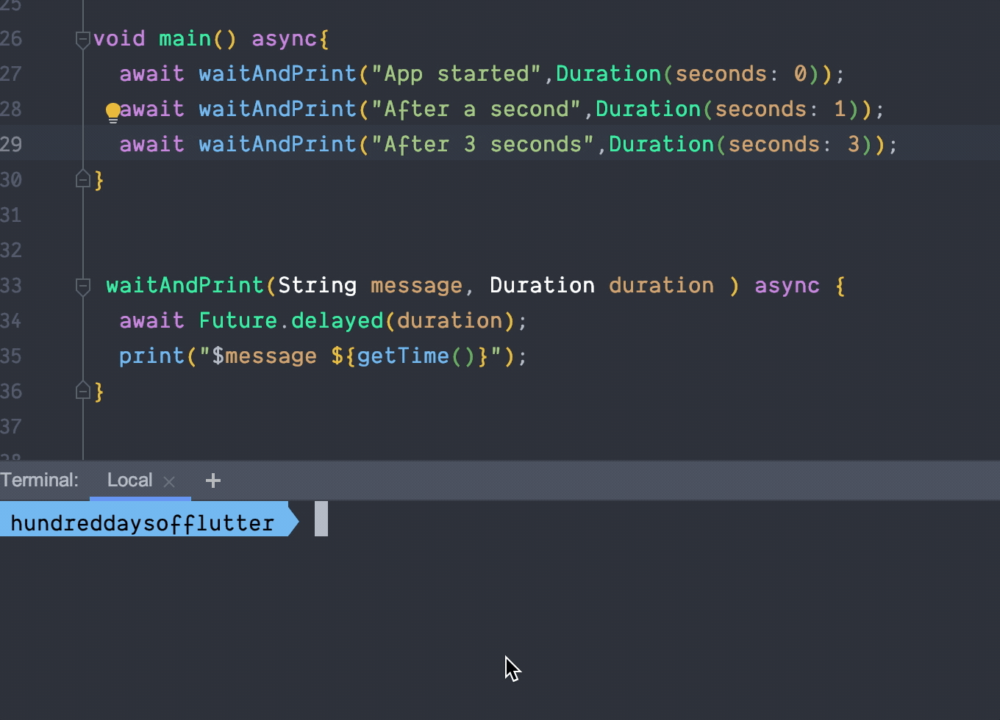

# Tips 71-77

## #Day71 MediaQuery

`MediaQuery` gives the information about screen like `height`, `width`, `pixels`, `notch size`, **Device scale factor & text scale factor set on setting**, `device theme light/dark` , system animation `enabled/disabled` etc.
[try on codepen](https://codepen.io/erluxman/pen/xxZEZGG)

## #Day72 Decimal points

Want to get desired number of digits after decimal?

1. Use `number.toStringAsFixed()`  
2. Parse the String to number.

For convenience we can use extension functions.
[try on dartpad](https://dartpad.dartlang.org/3bdfd6923d1e8788ed81eaae9e77655f)

## #Day73 String multiplication

You can multiply String like numbers.

    "Foo"*2 //Foo
    "Bar "*5 //Bar Bar Bar Bar Bar

## #Day74 enum values

Getting value of `enum` is **not trivial** in dart. This simple extension function can get rid of `Pain in the enum.`

1. Define this extension
2. Start calling `.asEnum()` in any `enum` to print the `Value`.
3. You can use underscore `_` if you want space between words.

[try in dartpad](https://dartpad.dartlang.org/f8233e822afa073a90018c3bf8a9e271)

## #Day75 Don't be afraid with `mixin`, it's here to help

### 💣 Spoiler : `mixin` is not related to Animation by any means 😂, its just another keyword like `class`

### But mixin is similar to

#### **fastfood 🍔/ plugin 🧩/ an interface with already implemented methods & state, that is ready to be used without reimplementing those features everywhere we need them**

When paired up with a `StatefulWidget`'s `State`,`TickerProviderStateMixin` creates `ticker` that ticks with every frame which is need by every AnimationController . It also disposes ticker when stateful widget disposes. That's why we provide `this` as TickerProvider(`vsync`) in every AnimationController.

Similarly we use ListMixin to use obvious implementation of List so that we do not have to implement obvious stuffs in every List implementation like `ElementList,NodeList,FileList,TouchList` etc.

`extends (inheritance)` => only one class can be inherited along with their public/protected members and behaviours.

`implements (contract)` => many classes can be implemented but we have to redefine every behaviour.

`with(mixin)` => Many classes can be mixed in and we can reuse the behaviour of them.

Any class or abstract class can be used as mixin. But we declare mixin, it cannot be extended like normal class or abstract class.

    class A{} //Declaring class
    mixin B{} //Declaring mixin
    class C extends A{} // Valid ✅
    class C extends B{} // Invalid ❌

A mixin cannot use another mixin.

    mixin C with B{} // Invalid ❌

#### Conclusion : Use `mixin` if you want to reuse the behaviour and state of multiple classes

## #Day76 CustomPainter

CustomPainter provides canvs to draw different shapes.

1. Define a class and extend CustomPainter.
2. Override paint(canvas,size) method and draw various shapes(circle,arc,rectangle,line etc) inside it.
3. Add a CustomPaint widget  on screen and pass the CustomPainter as paint and it's size.

Output

[try on codepen](https://codepen.io/erluxman/pen/YzwZpba)

## #Day77 Pause / wait program flow

Do you want pause program flow for a certain duration? You can use `Future.delayed()` :

`await Future.delayed( duration )`

[___`Tips 1-7`___](README.md)
[__`Tips 08-14`__](week02.md)
[__`Tips 15-21`__](week03.md)
[__`Tips 22-28`__](week04.md)
[__`Tips 29-35`__](week05.md)
[__`Tips 36-42`__](week06.md)
[__`Tips 43-49`__](week07.md)
[__`Tips 50-56`__](week08.md)
[__`Tips 57-63`__](week09.md)
[__`Tips 64-70`__](week10.md)

[__`<< Previous`__](week10.md)
[___`Tips 71-77`___](week11.md)
[__`Next >>`__](week12.md)

[__`Tips 85-91`__](week13.md)
[__`Tips 92-98`__](week14.md)
